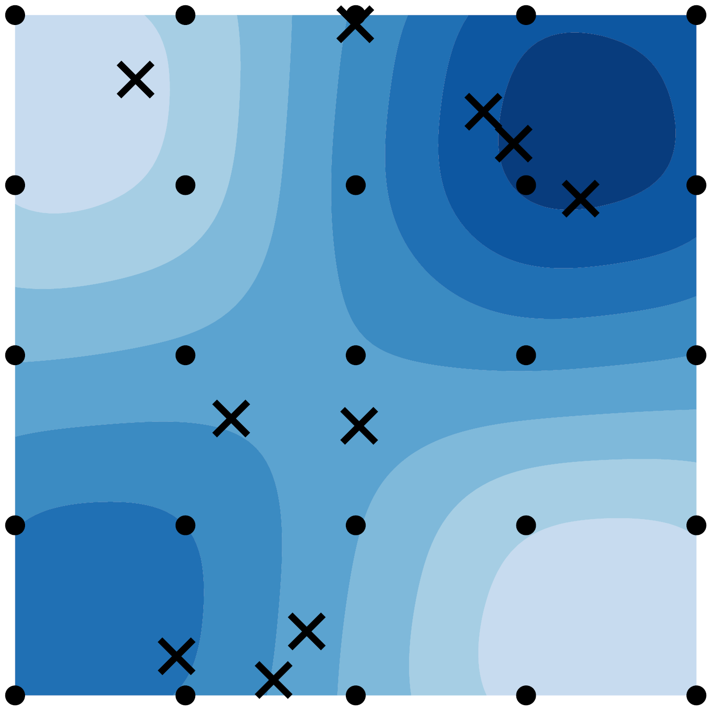
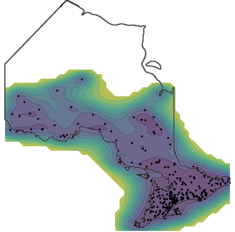

<table style="width:100%">
<tr>
<td><\td>
<td>
I am currently a PhD candidate at the University of Toronto conducting machine learning research on Bayesian methods for big data.
Much of my work has involved scaling Gaussian Processes to large datasets, however, I also work on discrete latent variable models as well as deep latent variable models.
I am an inherently curious individual with a diverse range of interests and I like dabbling in new fields and applications.
If you are interested in collaborating on an application, please reach out to me!   
  
[<a href="files/TreforEvans-CV.pdf">CV</a>]
[<a href="https://scholar.google.ca/citations?user=oNL-h7UAAAAJ">Google Scholar</a>]
[<a href="https://github.com/treforevans">Github</a>]
</td>
</tr>
</table>

# Publications
<table style="width:100%">
<tr>
<td> </td>
<td>
<strong> Discretely Relaxing Continuous Variables for tractable Variational Inference </strong>   
Trefor W. Evans and Prasanth B. Nair.    
 In Advances in Neural Information Processing Systems (NIPS), 2018.    
[<a href="https://arxiv.org/abs/1809.04279">Paper</a>]
[<a href="https://github.com/treforevans/direct">Code</a>]
</td>
</tr>
<tr>
<td> </td>
<td>
<strong> Scalable Gaussian Processes with Grid-Structured Eigenfunctions (GP-GRIEF) </strong>   
Trefor W. Evans and Prasanth B. Nair.    
International Conference on Machine Learning (ICML), 2018.   
[<a href="https://arxiv.org/abs/1807.02125">Paper</a>]
[<a href="https://github.com/treforevans/gp_grief">Code</a>]
[<a href="files/gp-grief_icml_slides.pdf">Slides</a>]
[<a href="files/gp-grief_icml_poster.pdf">Poster</a>]
</td>
</tr>
<tr>
<td> </td>
<td>
<strong> Exploiting Structure for Fast Kernel Learning </strong>  
Trefor W. Evans and Prasanth B. Nair.    
SIAM International Conference on Data Mining (SDM), 2018.    
[<a href="https://arxiv.org/abs/1808.03351">Paper</a>]
[<a href="https://github.com/treforevans/gp_grid">Code</a>]
[<a href="files/gappy_sdm_slides.pdf">Slides</a>]
[<a href="files/gappy_sdm_poster.pdf">Poster</a>]
</td>
</tr>
</table>

# Teaching
I have been a teaching assistant in 12 engineering undergrad and graduate courses at the University of Toronto. 

**Coming soon ...**    
During the winter 2019 term I will be co-instructing a new 3rd year Engineering Science course *ROB313 Learning from Data* alongside Prasanth B. Nair.

# Engineering
