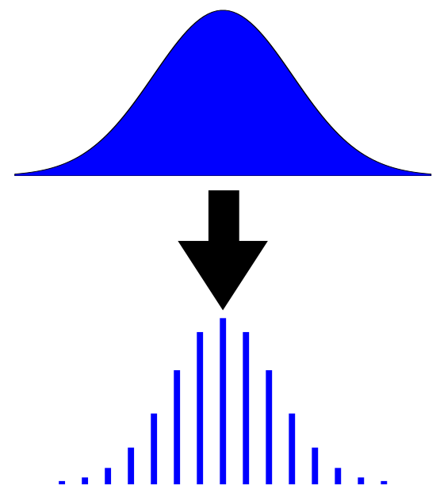

I am the co-founder and CEO of Infera AI, a new startup composed of researchers and faculty from the University of Toronto and MIT.
I am also completing my PhD at the University of Toronto. 
Before my PhD, I completed a BASc in Engineering Science at the University of Toronto. 
 

# Publications
My research primarily focuses on developing Bayesian inference algorithms for complex models that scale to large
datasets. 
  
<!--[<a href="files/TreforEvans-CV.pdf">CV</a>]-->
[<a href="https://scholar.google.ca/citations?user=oNL-h7UAAAAJ">Google Scholar</a>]
[<a href="https://github.com/treforevans">Github</a>]

###  Weak Form Generalized Hamiltonian Learning

Kevin L. Course, Trefor W. Evans and Prasanth B. Nair.    
Neural Information Processing Systems (NeurIPS), 2020   
[<a href="https://papers.nips.cc/paper/2020/file/d93c96e6a23fff65b91b900aaa541998-Paper.pdf">Paper</a>]
[<a href="https://github.com/coursekevin/weakformghnn">Code</a>]

We present a method for learning generalized Hamiltonian decompositions of ordinary differential equations given a set of noisy time series measurements. 
Our method simultaneously learns a continuous time model and a scalar energy function for a general dynamical system. 
Learning predictive models in this form allows one to place strong, high-level, physics inspired priors onto the form of the learnt 
governing equations for general dynamical systems. 
Moreover, having shown how our method extends and unifies some previous work in deep learning with physics inspired priors, 
we present a novel method for learning continuous time models from the weak form of the governing equations which is less computationally 
taxing than standard adjoint methods.
 

###  Quadruply Stochastic Gaussian Processes

Trefor W. Evans and Prasanth B. Nair.     
[<a href="https://arxiv.org/abs/2006.03015">Paper</a>]

We introduce a stochastic variational inference procedure for training scalable Gaussian process (GP) models whose per-iteration 
complexity is independent of both the number of training points, *n*, and the number basis functions used in the kernel approximation, *m*. 
Our central contributions include an unbiased stochastic estimator of the evidence lower bound (ELBO) for a Gaussian likelihood, 
as well as a stochastic estimator that lower bounds the ELBO for several other likelihoods such as Laplace and logistic. 
Independence of the stochastic optimization update complexity on *n* and *m* enables inference on huge datasets using large capacity GP models. 
We demonstrate accurate inference on large classification and regression datasets using GPs and relevance vector machines with up to *m*=107 basis functions. 
 

###  Discretely Relaxing Continuous Variables for tractable Variational Inference

Trefor W. Evans and Prasanth B. Nair.    
Neural Information Processing Systems (NeurIPS), 2018 (Spotlight Paper)   
[<a href="https://arxiv.org/abs/1809.04279">Paper</a>]
[<a href="https://github.com/treforevans/direct">Code</a>]
[<a href="https://youtu.be/x0XzyEJY0ds">Video (3 min)</a>]
[<a href="files/direct_spotlight_nips_slides.pdf">Slides</a>]
[<a href="files/direct_poster.pdf">Poster</a>]
[<a href="https://www.videoken.com/embed/6VT0nvWuv-4?tocitem=14">NeurIPS Spotlight</a>]

We explore a new research direction in variational inference with discrete latent variable priors.
The proposed "DIRECT" approach
can *exactly* compute ELBO gradients,
its training complexity is *independent* of the number of training points, and
its posterior samples consist of sparse and low-precision quantized integers.
Using latent variables discretized as extremely low-precision 4-bit quantized integers, we
demonstrate accurate inference on datasets with over two-million points where training takes just seconds.
 

### Scalable Gaussian Processes with Grid-Structured Eigenfunctions (GP-GRIEF)

Trefor W. Evans and Prasanth B. Nair.    
International Conference on Machine Learning (ICML), 2018 (Long Talk)   
[<a href="https://arxiv.org/abs/1807.02125">Paper</a>]
[<a href="https://github.com/treforevans/gp_grief">Code</a>]
[<a href="files/gp-grief_icml_slides.pdf">Slides</a>]
[<a href="files/gp-grief_icml_poster.pdf">Poster</a>]

We introduce a kernel approximation strategy that enables computation of the Gaussian Process log marginal likelihood and all hyperparameter derivatives in O(*p*) time,
where *p* is the rank of our approximation.
This fast likelihood evaluation enables type-I or II Bayesian inference on large-scale datasets.
We benchmark our algorithms on real-world problems with up to two-million training points and 1033 inducing points!
 

### Exploiting Structure for Fast Kernel Learning

Trefor W. Evans and Prasanth B. Nair.    
SIAM International Conference on Data Mining (SDM), 2018.    
[<a href="https://arxiv.org/abs/1808.03351">Paper</a>]
[<a href="https://github.com/treforevans/gp_grid">Code</a>]
[<a href="files/gappy_sdm_slides.pdf">Slides</a>]
[<a href="files/gappy_sdm_poster.pdf">Poster</a>]

We introduce two new approaches to perform exact Gaussian Process (GP) inference on massive image, video, spatial-temporal, or multi-output datasets 
with missing observations.
We demonstrate exact GP inference for a spatial-temporal climate modelling problem with 3.7 million training points as well as a video reconstruction problem with 1 billion points;
to the best of our knowledge exact GP inference has not been attempted before on this scale.
 

### Undergraduate Thesis

Trefor W. Evans    
University of Toronto, Engineering Science, 2014.    
[<a href="files/undergrad_thesis.pdf">Thesis</a>]
[<a href="http://www.aerovelo.com/mission-log/2015/7/24/aerodynamic-design-of-eta">Blog Post</a>]

Developed a practical inverse aerodynamic shape optimization design process to achieve highly laminar flow bodies with an optimal pressure recovery.
Using this process, I designed Eta, a vehicle that I later built with AeroVelo, and which currently holds the world speed record at 144.17km/hr on a flat road!
Checkout
the [short video of our record-breaking run](https://www.youtube.com/watch?v=0JIB-rMGqCE), and
the [AeroVelo project page](http://www.aerovelo.com/our-projects/#eta-speedbike).
 

# Teaching
#### UofT ROB313: Learning from Data
An introductory machine learning course for 3rd year Engineering Science students 
in the Robotics majour at the University of Toronto.
This is a brand new course that was built from the ground up and has a stronger emphasis on Bayesian methods
than other introductory machine learning courses.   
Spring 2019, 2020, 2021.

#### UofT AER1415: Computational Optimization
Teaching assistant.   
Spring 2017.

#### UofT AER407: Space Systems Design
Teaching assistant.   
Fall 2015, 2016, 2017, 2018, 2019.

#### UofT MIE301: Kinematics & Dynamics of Machines
Teaching assistant.   
Fall 2015, 2016.

#### UofT ESC101: Praxis I
Teaching assistant.   
Fall 2015, 2016.

#### UofT ESC102: Praxis II
Teaching assistant.   
Spring 2016.

#### UofT APS113: Engineering Strategies and Practice I
Teaching assistant.   
Fall 2015.

#### UofT APS112: Engineering Strategies and Practice II
Teaching assistant.   
Spring 2016.

# Engineering
### D3ACE

For several years I was the lead developer for the library D3ACE which is used in ongoing jet-engine development programs at Pratt & Whitney Canada.
D3ACE contains a suite of Bayesian machine learning models for design exploration and optimization.
 

### Atlas Human-Powered Helicopter

Our team AeroVelo, a small group of 6 engineering students and graduates, developed the human-powered helicopter that won the Igor I. Sikorsky prize;
the third largest monetary prize in aviation history at 250,000 USD which stood unclaimed for 33 years.
I led the design, optimization and construction of the massive 20m x 20m x 4m helicopter structure which is currently on permanent display at the Ontario Science Center.
I was the lead test pilot for the aircraft and I hold the FAI world endurance record for human-powered helicopter flight.
Checkout 
the [short video of us winning the Sikorsky prize](https://www.youtube.com/watch?v=syJq10EQkog),
the [short video of my record-breaking endurance flight](https://www.youtube.com/watch?v=MfR85XTzeQc), as well as
our [project page](http://www.aerovelo.com/atlas-helicopter).
 

### Eta Speedbike

Developed a high-speed Human-Powered land vehicle that travelled at 144.17 km/hr on a flat road to break the world land-speed record.
For [my undergraduate thesis](files/undergrad_thesis.pdf), I developed a practical aerodynamic shape optimization process to design Eta's highly laminar flow body (see [my blog post](http://www.aerovelo.com/mission-log/2015/7/24/aerodynamic-design-of-eta)). 
I also conducted other extensive research projects including structural and aero-structural optimization to design the vehicle's frame and wheels, and was one of the vehicle's test pilots. 
Our small team of 3 to 6 people manufactured all components in-house.
Checkout
the [short video of our record-breaking run](https://www.youtube.com/watch?v=0JIB-rMGqCE), and
our [project page](http://www.aerovelo.com/our-projects/#eta-speedbike).
 
